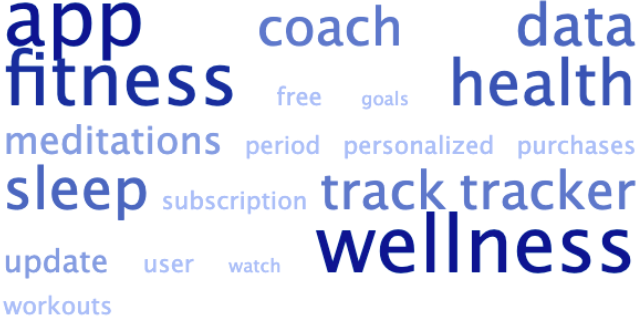
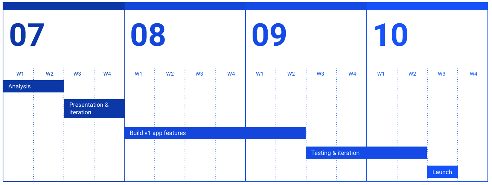

<style type="text/css">
div#TOC li {
    list-style:none;
    background-image:none;
    background-repeat:none;
    background-position:0; 
}
</style>

\newpage 
<br>
<br>
\tableofcontents 
<br>
<br>
<br>
\newpage

```{r setup, include=FALSE}
knitr::opts_chunk$set(
	echo = TRUE,
	message = FALSE,
	warning = FALSE
)
# load the library
library(lubridate)
library(tidyverse)
library(skimr)
library(forcats) #reorder dataframe before plot
library(janitor)
library(skimr)
library(ggcorrplot)
library(ggstatsplot)
library(ggridges)

```
```{r loading, include=FALSE}
#Reading all files in input directory into distinct dataframes
for ( file in list.files(path = "~/Documents/case_study_capstone/Cleaned Data ")){
  path <- paste0("~/Documents/case_study_capstone/Cleaned Data /",
                 file)                                        #filepath
  name <- paste0(substr(file, 1 , nchar(file) - 4))               #name of dataframe
  assign(name, read_csv(path))
  }

```


# Executive Summary  

+ The task of the case is to propose **new growth opportunities** for bellabeat, a smart device and fitness tracker company, by identifying third party smart device usage trends and applying them to gaps in bellabeat’s portfolio.  
+ **Key observations**:  
    -  Feature engineering was done to quantify user consistency     
    -  Majority of the users are consistently active to varying levels  
    -  Strong correlations exist between users' sleep data and their physical activity   
+ **Recommendations** are made to create levels of user achievement and leverage existing users' brand perception of bellabeat as a wellness company, to increase in app subscriptions of wellness coaching content. Suggestions for future expansion are also included.    

<br>
<br>
<br>

\newpage  

# Case Description  

<!--html_preserve-->
<div>
    <div style=" width: 20%; float: left;">
    ```{r image3, echo=FALSE,   out.width = '100%'}
knitr::include_graphics("https://raw.githubusercontent.com/neelima-j/bellabeat/main/Images/bellabeat-logo.png")
``` 
    </div>
   <div style="font-weight: bold; font-size: 2em; float: left;">
     How can a wellness company play it smart?
    </div>
    
</div>
<br>
<br>
<br>
<br>

<!--/html_preserve-->

<br>


## Company Profile  

Bellabeat is a successful small company, with the potential to become a larger player in the global smart device market. Founded in 2013, Bellabeat has grown rapidly and quickly positioned itself as a tech-driven wellness company for women. By 2016, Bellabeat had opened offices around the world and launched multiple products. Bellabeat products became available through a growing number of online retailers in addition to their own e-commerce channel on their website. 
<br>
<br>
<br>

## Product Portfolio

 ○ **Bellabeat app**: The Bellabeat app provides users with health data related to their activity, sleep, stress, menstrual cycle, and mindfulness habits. This data can help users better understand their current habits and make healthy decisions. The Bellabeat app connects to their line of smart wellness products.  
 ○ **Leaf**: Bellabeat’s classic wellness tracker can be worn as a bracelet, necklace, or clip. The Leaf tracker connects to the Bellabeat app to track activity, sleep, and stress.  
 ○ **Time**: This wellness watch combines the timeless look of a classic timepiece with smart technology to track user activity, sleep, and stress. The Time watch connects to the Bellabeat app to provide you with insights into your daily wellness.   
○ **Spring**: This is a water bottle that tracks daily water intake using smart technology to ensure that you are appropriately hydrated throughout the day. The Spring bottle connects to the Bellabeat app to track your hydration levels.  
 ○ **Bellabeat membership**: Bellabeat also offers a subscription-based membership program for users. Membership gives users 24/7 access to fully personalized guidance on nutrition, activity, sleep, health and beauty, and mindfulness based on their lifestyle and goals.  

<br>
<br>
<br>
\newpage

# Business Problem  

>Unlock new growth opportunities for the company by identifying smart device usage trends and applying them to gaps in Bellabeat’s portfolio.

<br>
<br>
<br>

# Data  

## Data Source 

The original data source is fitness tracker data for a thirty one day time period from thirty three users using a competitor's product. The dataset was generated by respondents to a distributed survey via Amazon Mechanical Turk between 12 April, 2016 and 12 May, 2016. Thirty Fitbit users consented to the submission of their personal tracker data.   

The dataset comprises eleven .csv files recording minute-level output for physical activity, heart rate, and sleep monitoring. Weight and BMI logs are also recorded.   
<br>


## Data Storage and Organization

The data is hosted in a kaggle dataset^[Kaggle: Fitness Tracker Dataset https://www.kaggle.com/arashnic/fitbit]. The project folder for this data analysis was set up in a local device with sub-folders for scripts, images, documentation and data. The data folder had raw data and cleaned data sub-folders. The original dataset was downloaded to the raw data sub-folder. 

<br>

## Data Cleaning

RStudio^[RStudio https://www.rstudio.com] with R as the programming language was used for data cleaning, analysis and visualizations. Rstudio projects was used to maintain a data environment and for file and folder management. RMarkdown was used to generate the project report. Each .csv file in the dataset was uploaded and viewed in Rstudio.   

**Data Completeness**: All thirty three users' steps data was complete. Sleep, heartrate, weight logging and exercise data is incomplete, with varying degrees of availability. Completeness across days also varies.   

**Data Integrity**: All the variables in each of the .csv files were examined and cleaned in the following ways:  
- User Id fields were converted to factors  
- Date and Time fields were converted from character strings to compatible datetime formats  
- Variable names and file names were changed to standard formats  
- Code used to examine and transform data is visible [here](https://github.com/neelima-j/bellabeat/tree/main/Scripts)  


**Bias and Credibility**: Data was verified by checking data ranges for all fields. Data distributions indicate some bias towards higher levels of activity among users. This may be due to self selection of the participants: they have purchased and use fitness trackers and have consented to be part of a study to share their activity data. This may have led to a bias towards higher activity.  

<br>
<br>
<br>

\newpage

# Exploratory Data Analysis


## Activity

Physical activity was tracked with steps, distance, active minutes and calories. Daily steps is considered^[2013 Tudor-Locke C, Craig CL, Thyfault JP, Spence JC. A step-defined sedentary lifestyle index https://pubmed.ncbi.nlm.nih.gov/23438219/] an easy to interpret proxy for general activity and lifestyle. In this dataset steps taken correlated highly with all the other measures of activity mentioned. This excludes the users whose primary exercise does not register steps. This is a potential case to be considered in future investigations, but does not impact this particular dataset's analysis. 

### Majority of Users are Consistently Active {-}
<div id="box"></div>
Self selection by purchasing a fitness tracker indicates a desire for exercise. Consistency was calculated as the percentage standard deviation from a personal daily mean number of steps. 

```{r activity, echo=TRUE, message=FALSE, warning=FALSE}
activity_summary %>% 
  ggplot(aes(x=steps_mean, y=steps_metric))+
  geom_point()+ 
  geom_smooth(method = "loess", alpha = 0.2)+
  theme_bw()+
  theme(panel.border = element_blank(),
        axis.line = element_line(colour = "black"))+
  scale_y_continuous(expand = c(0,0)) +
  scale_x_continuous(expand = c(0,0)) +
  labs(x="Mean Daily number of Steps", y="Percentage Standard Deviation",
       title = "Majority of Users are Consistently Active",
       subtitle = "Each point represents an individual") +
  annotate("rect", xmin = 0, xmax = 4000, ymin = 75, ymax = 160,
         alpha = .2)+
  annotate("text", x =1720, y = 165, label = "Sedentary - Erratic")+
annotate("rect", xmin = 5000, xmax = 16000, ymin = 0, ymax = 74,
         alpha = .2, fill = "green")+
  annotate("text", x =12000, y = 65, label = "Active - Consistent")
```
 
<br>
The grey box of users are erratic and tend to be sedentary, averaging fewer daily steps. The initial phase of the project can focus on the green box: it will be easier to target these users in the first pass due to their tendency to be consistently active.

<br>
<br>
<br>
\newpage

## Exercise

### Exercise Intensity - METs {-}

MET stands for the metabolic equivalent of task. One MET is the amount of energy used while sitting quietly. Physical activities may be rated using METs to indicate their intensity. For example, reading may use about 1.3 METs while running may use 8-9 METs. METs can also be translated into light, moderate, and vigorous intensities of exercise.^[Harvard T.H. Chan School of Public Health: The Nutrition Source: Measures of Exercise Intensity https://www.hsph.harvard.edu/nutritionsource/staying-active/]


User activities in this dataset are grouped into 4 categories: sedentary, light, moderate and vigorous intensities.


```{r table2, echo=FALSE, message=FALSE, warnings=FALSE, results='asis'}
tabl <- "  
| MET Range     | Description   | Example |
|:---------:|:-------|:--------------|
| 0 - 1.5      | Sedentary | Sitting, reclining, or lying down |
| 1.6 - 3.0      | Light    |Walking at a leisurely pace or standing in line at the store |
| 3.1 - 6.0 |    Moderate   |Walking briskly, vacuuming, or raking leaves |
| 6.0+ | Vigorous      |Walking very quickly, running, taking an aerobics class, or shoveling snow |
"
cat(tabl) # output the table in a format good for HTML/PDF/docx conversion
```

These patterns can be used to classify users. The distribution of the activities of users shows that most have a preference for moderate and vigorous activity.  


```{r mets-summary, echo=TRUE}
mets_summary %>% 
  ggplot()+
  geom_density_ridges(aes(x = max, y = id, group = id), alpha = 0.4)+
  geom_vline(aes(xintercept = median(max)+sd(max)),
             color = "orangered1",
             linetype = "dashed",
             size = .5) +
  geom_vline(aes(xintercept = median(max)-sd(max)),
             color = "orangered1",
             linetype = "dashed",
             size = .5) +
  xlim(-1,15)+
  theme_light()+
  scale_y_discrete(labels = NULL, breaks = NULL) +
  theme(legend.position = "none",
        panel.border = element_blank())+
  labs(x="Metabolic Equivalents (METs)", y="",
       title = "Frequency of Metabolic Activity", subtitle = "Each line is a user; Range of ±1SD indicates preference for Moderate & Vigorous activity", fill=NULL) 

```


<br>
<br>
<br>
\newpage

## Sleep

The dataset has tracked the sleep activity of the users for all times of the day in the one month duration. Therefore, sleeps of shorter duration (naps) are included. In the following distribution plot of all sleeps, the outliers to the left indicate the naps.  


```{r sleep, echo=TRUE, message=FALSE, warning=FALSE}
plot_sleep <-
  ggplot(data = cleaned_daily_sleep , aes(x = total_minutes_asleep / 60)) +
  geom_density(alpha = .4, fill = "darksalmon") +
  geom_vline(aes(xintercept = median((total_minutes_asleep / 60), na.rm = T)),
             color = "orangered1",
             linetype = "dashed",
             size = 1) +
  theme_light() +
  geom_label(aes(
    label = paste0("Median Sleep: ", round(median(total_minutes_asleep / 60), 2), " hrs"),
    x = 9,
    y = 0.2)) +
  scale_y_continuous(expand = c(0,0)) +
  theme(panel.border = element_blank(), 
        panel.grid.major.y = element_blank(),
        panel.grid.minor.y = element_blank(),
        axis.line = element_line(colour = "black")) +
  labs(x = "Hours of Sleep", y = "Frequency", fill = NULL)

plot_sleep
```

The median of the normal distribution of sleep time indicates a normal sleep. A classification of users' sleep habits was done to further examine correlations between activity and sleep quality.  


### Finding types of sleepers {-}

```{r summary, message=FALSE, warning=FALSE, include=FALSE}
activity_sleep <- full_join(activity_summary, sleep_summary, keep = FALSE)
mean_sleep <- activity_sleep %>% drop_na() %>% summarise(mean = mean(mean_sleep_hours))
activity_sleep <- activity_sleep %>% 
  replace_na(list(mean_sleep_hours = mean_sleep$mean)) 
```


Total daily sleep for each user was calculated. Users were classified into sleep categories^[NHS Live Well: Sleep and Tiredness https://www.nhs.uk/live-well/sleep-and-tiredness/how-to-get-to-sleep/] based on number of hours slept. 

```{r table3, echo=FALSE, message=FALSE, warnings=FALSE, results='asis'}
tabl <- "  
| Hours of Sleep   | Description   | 
|:----------:|:-------|
| 0 - 6      | Poor Sleep | 
| 6 - 9      | Normal Sleep |
| 9+         |    Oversleeping   |

"
cat(tabl) 
```

<br> An assumption is made that all participants are adults under 65 years of age, considering that sleep requirements vary across age groups^[Centers for Disease Control and Prevention: How Much Sleep Do I Need? https://www.cdc.gov/sleep/about_sleep/how_much_sleep.html]. The categorization is compared with the users' daily activity.  
```{r steps-sleep, echo=TRUE, fig.show="hold", out.width="50%"}
activity_sleep %>% 
  drop_na() %>% 
ggplot(aes(x= sleep_category, y = active_time_mean))+
  geom_boxplot(aes(color = sleep_category))+ 
  theme_bw()+
  labs(x="Sleep Quality", y="Average Daily Active Minutes",
       title = "Sleep Quality and Activity",
       subtitle = "Daily Active Time indicates Normal sleep")+
  theme(panel.border = element_blank(),
        panel.grid.major = element_blank(),
        panel.grid.minor = element_blank(),
        axis.line = element_line(colour = "black"),
        legend.position = "none")

#PLOT 2
activity_sleep %>% 
  drop_na() %>% 
ggplot(aes(x= sleep_category, y = active_time_metric))+
  geom_boxplot(aes(color = sleep_category))+ 
  theme_bw()+
  labs(x="Sleep Quality", y="Percentage Standard Deviation in Daily Active Minutes",
       title = "",
       subtitle = "Consistent Active Time indicates Normal sleep")+
  theme(panel.border = element_blank(),
        panel.grid.major = element_blank(),
        panel.grid.minor = element_blank(),
        axis.line = element_line(colour = "black"),
        legend.position = "none")

```

We observe that users with normal sleep quality tend to have consistent and higher daily activity.  

<br>
<br>
<br>

\newpage

<div id="weight"></div>
## Weight Logs

Of all the thirty three users, only 8 have reported their weights during the month of data collection. Of these, there are manual, and automatic or smart reports.   

### Who logs their weight?  {-}

```{r logging-weight, echo=TRUE, message=FALSE, warning=FALSE}

records<- full_join(cleaned_weight_log , activity_summary, keep = FALSE) %>% 
  group_by(id, is_manual_report) %>% 
  summarise(count =n()) %>% 
  replace_na(list(is_manual_report = "Weight Not Recorded"))
recording_type <- records %>% 
  group_by(is_manual_report) %>% 
  summarise(count = n())

recording_type %>% 
  ggplot(aes(x=is_manual_report, y=count))+
  geom_col(aes(fill = count))+
  theme_minimal()+
  theme(panel.border = element_blank(),
        panel.grid.major = element_blank(),
        panel.grid.minor = element_blank(),
        legend.position = 'none' )+
  labs(title = "Product Gap: Connected Scales", subtitle = "Most users do not manually record weight", 
       x = "", y = "")+
   ylim(0,25)+
  scale_x_discrete(labels=c("FALSE" = "Automatic Recording", "TRUE" = "Manual Recording"))+
  scale_y_discrete(labels = NULL, breaks = NULL) +
 labs(y = "")+
geom_text(aes(label = paste0(round(count/.33,0), '%'), y=count-1),
          color = "white", size = 6)
```
<br>
We observe that the majority do not record their weights or BMI. The minority of users with smart scales or devices that can automatically record weight indicates an opportunity to expand the product portfolio. 


<br>
<br>
<br>
<br>

\newpage

# Recommendations  

Increasing consistency in daily activity indicates improved user wellness. This focus on wellness ties in with the brand perception^[Apple app store reviews https://apps.apple.com/us/app/bellabeat-wellness-coach/id1005052173#see-all/reviews] of bellabeat. 

```{r image2, echo=FALSE, fig.cap="App store reviews of bellabeat app",  out.width = '60%'}

``` 
The short term focus of **new growth opportunities is coaching within the app**. The user reviews indicate a strong positive preference for in app content outside of regular transactional data. 

<br>

## Short Term 

> What can be done to monetize existing users?  
> Reward consistency!  

The short term solution can be to grow by increasing subscriptions and in-app purchases through gamification and a tiered system of activity levels.

Consistency in daily number of steps, number of hours of sleep, regular bedtimes can be tracked in the app. This can be rewarded and gamified to encourage repeat user interactions within the app. 

By creating tiers of activity and consistency, we nudge more users to be consistent from inactive to the active categories discovered in user classification<sup>[link](#box)</sup>. The majority of smart device users are generally consistent and may appreciate the recognition. This drives them to use the benefits of tier based discounts to in-app subscriptions and bellabeat products.


**WHAT**: Increase growth by driving wellness app subscriptions.  

**WHY**: Consistent activity correlated with increased wellness.  

**HOW**: Classify users into activity categories  
    Prioritize feature rollout for consistently active active users  


**Timeline of Events**

```{r image1, echo=FALSE,   out.width = '100%'}

``` 

<br>
<br>

## Medium Term

**Further Exploration for app-v2**   The following questions can guide data collection for further iterations of the bellabeat app content development.

<br>

>What is the impact of gender on the existing analysis?

bellabeat is a womxn centric product and usage patterns may differ by gender. The dataset for the current analysis makes no mention of gender of users. Data related to reproductive health is also absent. 


>What do app reviews say? 

Sentiment and Text Analysis can be done on reviews to explore product and feature gaps. In addition to reviews in app stores and on the company website, data can be scraped from other third party review websites and social media. 

<br>
<br>

## Long Term

**Further Exploration: Product Portfolio**

The analysis of weight logs <sup>[link](#weight)</sup> showed that 76% of users in the dataset do not log their weights periodically.    


<!--html_preserve-->
<div>
    <div style=" width: 30%; float: right;">
```{r image4, echo=FALSE,   out.width = '100%'}
knitr::include_graphics("https://raw.githubusercontent.com/neelima-j/bellabeat/main/Images/smartscale.png")
``` 
    </div>
   <div style=" width: 70%; float: left;">
   Of the 24% that have weight logs, the majority do so manually. bellabeat's portfolio already has a smart water bottle and can augment its connected devices portfolio with smart scales. <br><br> <p>The market research and product development research for other connected devices that align with bellbeats' wellness brand can be explored in the long term. </p>
    </div>
    
</div>


<!--/html_preserve-->

<br>
<br>
<br>
<br>
<br>
<br>
<br>
<br>
<br>
<br>

\newpage

----------------

# References  
